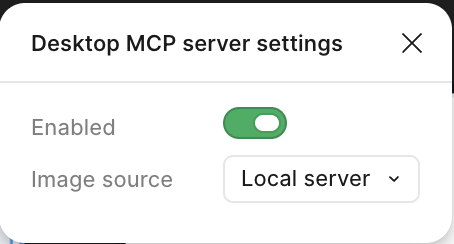

# Design-To-UI

Figma 디자인을 네이티브 UI(Android Compose/XML, iOS SwiftUI/UIKit)로 변환하는 Claude Code 플러그인입니다.

## 빠른 설치 (복붙)
(개발용)
```text
클로드야 https://github.com/naver/design-to-ui 이거 설치해줘.
design-to-ui, design-qa 써보고 싶어. 설치하고 나서 이 마켓 오토업데이트도 켜줘.
그리고 이 프로젝트 .claude/skills/ 에 project-design-system 스킬이 없으면,
generate-project-design-system 스킬로 이 프로젝트에 맞는 초안을 만들어줘.
앞으로 이 플러그인으로 작업하다 gotcha(막힘→해결)·이슈·문의·공유거리가 생기면 /discussion으로 남기자고 먼저 제안하도록, 이 규칙을 **메모리에 저장**해줘(다음 세션부터 적용되게).
```
(Android/iOS 선디자인검수용)
```text
클로드야 https://github.com/naver/design-to-ui 이거 설치해줘.
선디자인검수 커맨드 써보고 싶어. 설치하고 나서 이 마켓 오토업데이트도 켜줘.
그리고 안드로이드스튜디오, Xcode도 설치하고, figma desktop mcp도 연결해야 해. 또, iOS는 대중적인 모바일 애뮬레이터를, 안드로이드는 폴더블, 모바일, 태블릿을 모두 확인할 수 있는 resizable 애뮬을 설치해서, 나중에 /figma-start 쓰면 바로 빌드해볼 수 있도록 해야 해. (에뮬레이터 확인용으로는 빈 프로젝트를 만들어도 돼 — 검수할 프로젝트는 /figma-start에 PR 링크만 주면 클론해서 열어줄 거니까.)
도와줘. 최대한 너가 할 수 있는 건 다 해주고, 내가 해야하는 건 친절하게 알려줘. 이 레포 리드미 정보들을 참고하면 돼.
세션 재시작은 딱 한 번만 하고 싶어. 그러니까 재시작이 필요한 작업(플러그인 로드, MCP 연결 등)은 관련 설치·설정을 전부 재시작 전에 몰아서 끝내줘. 내가 직접 해야하는 것(로그인, App Store 설치, 앱 실행 등)도 재시작 전에 다 하도록 순서대로 한 번에 알려줘. 모든 준비가 끝나서 "이제 재시작만 하면 되는" 상태가 되면, 그때 딱 한 번 재시작하도록 안내하고, 새 세션 첫 프롬프트로 복붙할 핸드오프 프롬프트를 만들어줘.
나 다음 스펙부터 선디자인검수해보고 싶어. 재시작 후엔 리드미랑 커맨드 참고해서 선디자인검수 사용법 설명해주고, 다음 스펙부터 어떻게 검수하는지, 개발자에게 어떻게 메시지 보내면 될지 알려줘. 프로젝트를 클론해서 열고, 커맨드들을 써야 하니까 깃 설치도 필요하겠어. 너만 믿을게!
앞으로 이 플러그인으로 작업하다 gotcha(막힘→해결)·이슈·문의·공유거리가 생기면 /discussion으로 남기자고 먼저 제안하도록, 이 규칙을 **메모리에 저장**해줘(다음 세션부터 적용되게). 특히 선디자인검수 커맨드 중 /handoff를 처음으로 사용했을 때는, 선디자인검수 워크플로우를 한 바퀴 시행해본 거니까, '선디자인검수 도입 경험공유' 차원에서 /discussion으로 남기자고 먼저 제안하도록, 이 규칙을 **메모리에 저장**해줘
```

*클로드 사용 시, Shift + Tab 으로 auto mode로 바꿔놓으면, 좀 더 편하게 하실 수 있습니다!

### 🎉 Contribution을 환영합니다! (Web·Flutter 확장, 버그 수정 등) Fork 후 Pull Request를 보내주세요 🎉
> 설치 후 사용 중 **gotcha·이슈·문의·공유거리**가 생기면 `/discussion` — 세션을 자동 요약해 우리 Discussions에 분류·등록합니다(등록 전 확인).

네이티브 변환에 필요한 로직(에셋 A/B/C 분류, 동적 비주얼, 디자인 시스템 토큰 매핑, 에셋 파이프라인)을 7-Step 파이프라인으로 구성했습니다. **Step 1·2·3·7은 플랫폼 공통**이고, **Step 4·5(에셋)·6(코드 생성)만 플랫폼별로 분기**합니다 — 공통 절차는 spine에 한 벌만 두고, 에셋 사양(작음)은 SKILL.md Step 4의 플랫폼 표로, 코드 변환 규칙(큼)은 `references/<platform>/`로 분리합니다.

## 스킬 구성

| 스킬 | 역할 | 위치 |
|------|------|------|
| **design-to-ui** | 메인 워크플로우 — 7-Step 파이프라인. Step 1·2·3·7 공통 spine + Step 4·5·6 플랫폼 분기(Android/iOS) + 검증 | 플러그인 |
| **generate-project-design-system** | 프로젝트 코드를 분석하여 `project-design-system` 스킬의 초안을 자동 생성 | 플러그인 |
| **project-design-system** | 프로젝트 디자인 시스템 토큰 매핑 (색상, 타이포, 배경, 공통 컴포넌트) — **프로젝트별 커스터마이징 필요** | **프로젝트** `.claude/skills/` |
| **figma-asset-download** | Figma REST API로 SVG/PNG 다운로드 (범용, 플랫폼 무관) | 플러그인 |
| **design-qa** | 빌드된 앱 화면을 Figma와 오버레이(diff 히트맵·픽셀 비교)로 대조하고 코드 오차를 자동 보정하는 검증 루프 (Android/iOS) | 플러그인 |
| **figma-diff-apply** | Figma 변경분만 `design/*` 브랜치 코드에 최소 반영 (iteration N→N+1용) | 플러그인 |
| **discussion** | 사용 중 겪은 gotcha(추가 프롬프트로 해결한 경험)·아이디어·도입 사례를 GitHub Discussions에 등록. 세션 자동 요약 + 카테고리 폼(`.github/DISCUSSION_TEMPLATE`) 준수, 등록 전 사용자 확인 | 플러그인 |

> **`project-design-system`은 이 플러그인에 포함되지 않습니다.**
> 프로젝트마다 디자인 시스템이 다르므로, 각 프로젝트의 `.claude/skills/project-design-system/SKILL.md`에 직접 작성합니다.
> `design-to-ui`의 `requires: [project-design-system]`은 이름 기반으로 해석되어, 프로젝트 스킬 디렉터리에서 자동 로드됩니다.
> 플러그인에 포함된 `generate-project-design-system` 스킬로 이 초안을 자동 생성할 수 있습니다.

## 커맨드 구성

디자이너가 개발자의 원본 PR 위에서 피그마 변경을 반복 반영하고, 완료 시 개발자에게 핸드오프하기 위한 슬래시 커맨드입니다.

| 커맨드 | 역할 | 사용자 |
|--------|------|--------|
| **`/figma-start`** | dev PR 기반 **프로젝트 클론** + `design/*` 브랜치 생성·체크아웃 + IDE 열기 (커밋 없음). 빌드 검수 시작용. | 디자이너 |
| **`/figma-apply`** | 피그마 변경을 현재 `design/*` 브랜치에 커밋·푸시. 반복 호출 가능. | 디자이너 |
| **`/handoff`** | `design/*` 브랜치 → dev 브랜치 타겟 PR 생성, dev PR 작성자를 리뷰어로 지정. | 디자이너 |

### 선디자인검수 플로우

1. 개발자가 스펙, 피그마가이드 기반으로 Design-To-UI 플러그인을 활용하여 빠르게 원본 PR을 만듭니다. (결과물 : design-qa 미세조정까지 거친, 완벽한 ui)
2. 디자이너가 `/figma-start <dev_pr_link>` 실행 → **프로젝트가 로컬에 없으면 `~/{repo}` 에 클론되고 IDE로 열립니다**(미리 받아둘 필요 없음), `design/{github_id}/{dev_pr_number}` 브랜치가 생기고 체크아웃됩니다 (커밋 없음). 한 dev PR에 몇 번이든 다시 실행할 수 있습니다.
3. `/figma-start`가 그 브랜치를 빌드해 기기에 올려줍니다 (실행할 기기·에뮬레이터가 없으면 검수에 맞는 걸 설치해서 만듭니다 — Android는 폰·폴더블·태블릿을 하나로 볼 수 있는 resizable 에뮬레이터). 올라온 화면을 검수하고, 피그마에서 수정이 필요하면 해당 피그마 화면 수정 후 `/figma-apply <figma_link>` 실행 → 변경이 커밋·푸시됩니다.
4. 추가 수정이 필요하면 피그마 수정 후 `/figma-apply <figma_link>` 반복 — dev PR은 현재 브랜치에서 자동 추론됩니다.
5. 확인이 필요한 케이스도 개발자에게 요구할 필요 없이, 클로드에게 요구하여 확인합니다. (ui확인을 위해 에러케이스, 로딩중 화면 보고 싶어)
6. 작업이 끝나면 `/handoff` 실행 → PR 생성 + 개발자 리뷰 요청. (수정이 필요한 잔여작업이 있다면, 개발자에게 pr 코멘트로 요청)
7. QA 시점에 최종 확인 (핑퐁이 없을 것으로 기대)

### 디자이너 브랜치 컨벤션

- `design/{github_id}/{dev_pr_number}` — dev PR이 `my-org/weather-app` 의 `#1234`이고 내 GitHub 계정이 `my-id`면 `design/my-id/1234`
- **프로젝트명은 넣지 않습니다** — 브랜치는 그 프로젝트 레포 안에만 있으니 이름에 또 적어도 구분되는 게 없습니다. 한 레포 안에서 PR 번호는 유일하고, 사람 구분은 `{github_id}`가 합니다.
- dev **브랜치명이 아니라 dev PR 번호**를 씁니다. 개발자가 브랜치를 rename·rebase해도 안 깨지고, `/handoff`가 이름을 역추측하는 대신 번호로 원본 PR을 바로 조회할 수 있습니다.
- 한 dev PR에 검수 횟수 제한이 없습니다. 같은 이름이 로컬·원격에 이미 있으면, 그 브랜치에 뭐가 반영돼 있는지 요약해 보여주고 **이어서 할지 / dev PR 기준으로 새로 시작할지 물어봅니다**. 새로 시작을 고르면 `-2`, `-3` … 을 붙입니다 (PR 번호는 순수 숫자라 `1234-2` 분해에 모호함이 없습니다).
- `/figma-start`, `/figma-apply`, `/handoff` 모두 이 규칙에 의존하므로 임의로 변경하지 마세요.

## MCP 서버

| MCP 서버 | 설명 |
|----------|------|
| `figma-desktop` | Figma Desktop 앱 연동 — 디자인 컨텍스트, 스크린샷, 변수 정의 조회 |

## 설치

### 1단계: Figma Desktop 앱 설정

1. [Figma Desktop 앱](https://www.figma.com/downloads/) 설치
2. Figma Desktop 앱 실행
3. 우측탭 > mcp 활성화



### 2단계: Figma Personal Access Token 설정

에셋 다운로드에 필요합니다:

1. [Figma Settings](https://www.figma.com/settings)에서 Personal Access Token 발급 (권한: `file_content:read`)
2. 환경 변수 설정:

```bash
echo 'export FIGMA_ACCESS_TOKEN="figd_xxx"' >> ~/.zshrc && source ~/.zshrc
```

### 3단계: 에셋 변환 도구 설치 (선택)

SVG → Vector Drawable XML 변환에 필요합니다:

```bash
npm install -g vd-tool          # SVG → VD
brew install webp                # PNG → WebP (macOS)
export JAVA_HOME="/Applications/Android Studio.app/Contents/jbr/Contents/Home"
```

### 4단계: Claude Code에 플러그인 설치

```
/plugin marketplace add https://github.com/naver/design-to-ui.git
```

`/plugin` 명령어 실행 후 `design-to-ui` 플러그인을 선택하여 설치합니다.

설치 완료 후 Claude Code를 재시작하세요.

### 5단계: project-design-system 스킬 설정

프로젝트 루트에 디자인 시스템 스킬을 생성합니다:

```
.claude/skills/project-design-system/SKILL.md
```

플러그인에 포함된 `generate-project-design-system` 스킬을 사용하면 프로젝트 코드를 분석하여 이 초안을 자동 생성할 수 있습니다 — "디자인 시스템 스킬 만들어줘"라고 요청하면 트리거됩니다. 작성 시 아래 참고 자료도 활용하세요:

- **자동 생성 스킬:** [`generate-project-design-system`](plugins/design-to-ui/skills/generate-project-design-system) — 프로젝트 코드를 분석하여 project-design-system 스킬을 자동 생성 (플러그인 포함)

## 사용법

Figma URL을 Claude Code에 붙여넣으면 자동으로 스킬이 트리거됩니다:

```
https://figma.com/design/xxx/Design?node-id=123-456
이 피그마 레이어를 Compose UI 코드로 변환해줘.
```

AI가 프로젝트를 분석하여 플랫폼(Android/iOS)과 프레임워크(Compose/XML/SwiftUI/UIKit)를 자동 판단하고, 해당 `references/<platform>/` 문서를 로드합니다.

## 커스터마이징

### project-design-system (필수)

각 프로젝트의 `.claude/skills/project-design-system/SKILL.md`를 프로젝트에 맞게 작성합니다:

1. **색상 매핑** — `colorScheme.green.*` → 자기 프로젝트의 테마 색상 경로로 변경
2. **타이포** — `AppTypography.pretendard` → 자기 프로젝트의 폰트로 변경
3. **배경** — `AppBackground` → 자기 프로젝트의 배경 컴포넌트로 변경
4. **공통 컴포넌트** — `CloseButton`, `focusBorder` 등 → 자기 프로젝트의 공통 컴포넌트로 변경
5. **참고 구현 경로** — 파일 경로를 자기 프로젝트의 대표 화면으로 교체

> **Tip:** 직접 작성하기 어려우면 플러그인에 포함된 [`generate-project-design-system`](plugins/design-to-ui/skills/generate-project-design-system) 스킬로 프로젝트를 분석하여 자동 생성할 수 있습니다.

### design-to-ui / figma-asset-download

대부분의 프로젝트에서 수정 없이 사용 가능합니다.

## 저장소 구조

```
Design-To-UI/
├── .claude-plugin/
│   └── marketplace.json              # 플러그인 마켓플레이스 설정
├── plugins/
│   └── design-to-ui/                  # Design to UI 플러그인
│       ├── .claude-plugin/
│       │   └── plugin.json
│       ├── .mcp.json                 # MCP 서버 설정 (figma-desktop)
│       ├── CLAUDE.md                 # Claude 행동 규칙
│       ├── commands/
│       │   ├── figma-start.md        # dev PR 기반 프로젝트 클론 + design/* 브랜치 생성·체크아웃 + 빌드·실행
│       │   ├── figma-apply.md        # 피그마 변경 → design/* 브랜치 반영
│       │   └── handoff.md            # design/* → dev 브랜치 PR + 리뷰 요청
│       └── skills/
│           ├── design-to-ui/
│           │   ├── SKILL.md                  # 7-Step 메인 워크플로우 (공통 spine + 플랫폼 분기)
│           │   ├── references/              # Step 6 코드 변환 규칙 (프레임워크별)
│           │   │   ├── android/
│           │   │   │   ├── compose.md        # Step 6 Compose 변환
│           │   │   │   └── xml.md            # Step 6 XML Layout 변환
│           │   │   └── ios/
│           │   │       ├── swiftui.md        # Step 6 SwiftUI 변환
│           │   │       └── uikit.md          # Step 6 UIKit 변환
│           │   └── scripts/
│           │       ├── android/
│           │       │   ├── convert_assets.sh # SVG→VD, PNG→WebP 변환
│           │       │   └── preprocess_svg.py # SVG 전처리
│           │       └── ios/
│           │           └── convert_assets.sh # SVG→PDF, Asset Catalog 생성
│           ├── generate-project-design-system/
│           │   └── SKILL.md              # 프로젝트 분석 → project-design-system 초안 자동 생성
│           ├── figma-diff-apply/
│           │   └── SKILL.md              # 피그마 변경점 식별 + 최소 코드 수정 (figma-apply Section 2 위임 대상)
│           ├── figma-asset-download/
│           │   ├── SKILL.md              # Figma REST API 에셋 다운로드
│           │   └── scripts/
│           │       └── download_figma_frame_images.sh
│           ├── design-qa/
│           │   ├── SKILL.md              # 실기기/시뮬 캡처 → Figma 오버레이 대조·자동 보정 검증 루프
│           │   ├── references/           # 플랫폼별 캡처·보정 어휘 (android.md · ios.md)
│           │   └── scripts/              # overlay · *_probe · ledger_gate 등
│           └── discussion/
│               └── SKILL.md              # 사용 경험(gotcha·아이디어·도입)을 Discussions에 폼 준수 등록
└── README.md
```

> **참고:** `project-design-system`은 각 프로젝트의 `.claude/skills/project-design-system/SKILL.md`에 위치합니다.

## 고지 (Notice)

본 프로젝트는 Figma가 공개한 implement-design skill의 절차적 아이디어를 고수준에서 참고하였으며, 세부 설계 및 구현은 당사가 독자적으로 수행하였습니다. 본 프로젝트는 Figma의 소스코드, skill 문서, 문서 텍스트 또는 기타 Figma Developer Resources를 복제, 수정, 포함 또는 재배포하지 않습니다.

본 프로젝트는 Figma, Inc.와 제휴, 후원 또는 승인 관계에 있지 않습니다. "Figma" 및 관련 표장은 Figma, Inc.의 상표입니다.

This project was independently developed by NAVER, with only high-level reference to implement-design skill's 7-step structure idea. It does not copy, modify, include, or redistribute any Figma source code, skill text, documentation text, or other Figma Developer Resources.

Figma and related marks are trademarks of Figma, Inc. This project is not affiliated with, endorsed by, or sponsored by Figma, Inc.

## 관련 링크

- 디자인 시스템 초안 자동 생성: 플러그인 포함 `generate-project-design-system` 스킬

<!--
Design-To-UI
Copyright (c) 2026-present NAVER Corp.
Apache-2.0
-->
